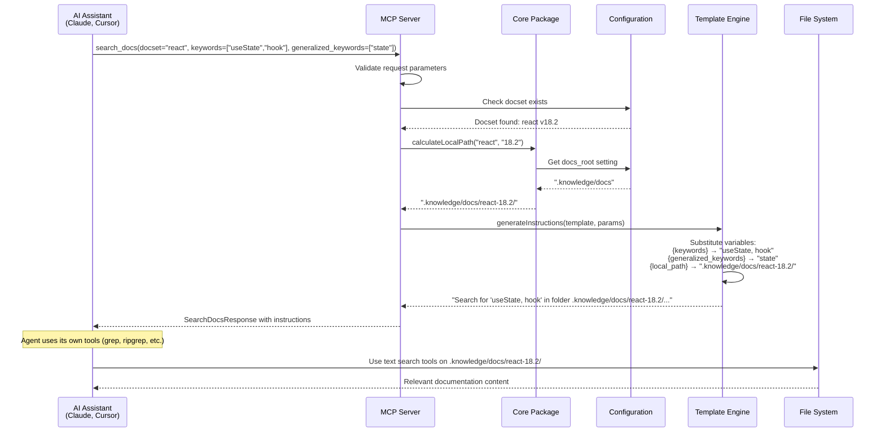

<!--

**About arc42**

arc42, the template for documentation of software and system
architecture.

Template Version 8.2 EN. (based upon AsciiDoc version), January 2023

Created, maintained and © by Dr. Peter Hruschka, Dr. Gernot Starke and
contributors. See <https://arc42.org>.

<div class="note">

This version of the template contains some help and explanations as comments.

Remove the comments after completing a section.

</div>
-->

# Introduction and Goals

## Requirements Overview

**Contents**

The Agentic Knowledge Guidance System is a standalone MCP server that provides intelligent navigation instructions for AI coding assistants to access documentation. Instead of traditional search results, it returns guidance on where to look and how to search for information.

**Motivation**

AI coding assistants are moving beyond traditional RAG limitations with larger context windows and better text analysis capabilities. Rather than building complex search infrastructure, this system leverages the agent's existing tools (grep, ripgrep, file reading) by providing intelligent routing guidance.

**Form**

The system provides two core MCP tools:

- `search_docs(docset, keywords, generalized_keywords)` - Returns navigation instructions
- `list_docsets()` - Lists available documentation sets

## Quality Goals

| Priority | Quality Goal        | Scenario                                                      |
| -------- | ------------------- | ------------------------------------------------------------- |
| 1        | **Simplicity**      | Zero AI/ML dependencies, pure configuration-driven routing    |
| 2        | **Reliability**     | <10ms response time, no external service dependencies         |
| 3        | **Predictability**  | Deterministic configuration discovery, no fallback complexity |
| 4        | **Maintainability** | Clean monorepo structure, minimal dependencies                |
| 5        | **Extensibility**   | Template-based instruction generation, modular packages       |

## Stakeholders

| Role/Name            | Contact              | Expectations                                                |
| -------------------- | -------------------- | ----------------------------------------------------------- |
| AI Coding Assistants | Claude, Cursor, etc. | Fast, reliable guidance to relevant documentation           |
| Developers           | Project teams        | Simple setup, predictable behavior, no maintenance overhead |
| Documentation Teams  | Technical writers    | Easy docset configuration, flexible instruction templates   |

# Architecture Constraints

## Technical Constraints

| Constraint          | Explanation                                                       |
| ------------------- | ----------------------------------------------------------------- |
| TypeScript Monorepo | Must use proven TypeScript monorepo template for consistency      |
| MCP SDK Standard    | Required to use @modelcontextprotocol/sdk for protocol compliance |
| YAML Configuration  | Human-readable configuration files required                       |
| NPM Distribution    | Package distributed via NPM like responsible-vibe                 |
| No LLM Integration  | System must remain AI-free for reliability and speed              |

## Organizational Constraints

| Constraint                  | Explanation                                                    |
| --------------------------- | -------------------------------------------------------------- |
| No Fallback Configuration   | Single configuration discovery pattern, no global fallbacks    |
| `.knowledge` Folder Pattern | Must follow established `.vibe` folder pattern for consistency |
| Single Docset Queries       | No multi-docset search complexity                              |

# Context and Scope

## Business Context

**Agentic Knowledge Guidance System**

| Communication Partner | Inputs                                       | Outputs                                  |
| --------------------- | -------------------------------------------- | ---------------------------------------- |
| AI Coding Assistants  | MCP tool calls (search_docs, list_docsets)   | Navigation instructions, docset listings |
| Developers            | Configuration files (.knowledge/config.yaml) | Docset path mappings                     |
| File System           | Documentation folders                        | Local path calculations                  |

## Technical Context

**MCP Protocol Integration**

The system integrates with AI coding assistants through the Model Context Protocol (MCP):

- **Input Channel**: JSON-RPC 2.0 over stdio
- **Output Channel**: JSON-RPC 2.0 responses with instruction strings
- **Configuration Channel**: File system access to .knowledge folder

**File System Integration**

- **Configuration Discovery**: Walk up directory tree for `.knowledge/config.yaml`
- **Documentation Access**: Local paths to documentation folders
- **Path Calculation**: Deterministic mapping from docset name/version to local paths

# Solution Strategy

## Core Strategy: Guidance Over Search

Instead of performing search operations, the system provides intelligent navigation instructions that leverage the AI agent's existing text analysis capabilities.

**Technology Decisions**

- **TypeScript**: Proven monorepo template for maintainability
- **MCP SDK**: Industry standard for AI assistant integration
- **YAML**: Human-readable configuration format
- **Template Engine**: Simple variable substitution for instruction generation

**Architectural Patterns**

- **Configuration-Driven**: All behavior controlled by declarative YAML config
- **Package Separation**: Clean separation between core logic and MCP protocol
- **Template-Based**: Flexible instruction generation through string templates

**Quality Achievement**

- **Simplicity**: No AI processing, pure configuration mapping
- **Reliability**: Minimal dependencies, deterministic behavior
- **Performance**: <10ms response time through simple lookups

# Building Block View

## Whitebox Overall System

```
┌─────────────────────────┐
│   AI Coding Assistant   │
│    (Claude, Cursor)     │
└─────────────┬───────────┘
              │ MCP Protocol
              │ (JSON-RPC)
┌─────────────▼───────────┐
│  Agentic Knowledge MCP  │
│        Server           │
└─────────────┬───────────┘
              │
┌─────────────▼───────────┐
│     Core Package        │
│  (Config + Templates)   │
└─────────────┬───────────┘
              │
┌─────────────▼───────────┐
│    .knowledge Folder    │
│  config.yaml + docs/    │
└─────────────────────────┘
```

**Motivation**

Clean separation between protocol handling, business logic, and configuration ensures maintainability and testability.

**Contained Building Blocks**

| Name                       | Responsibility                                                                  |
| -------------------------- | ------------------------------------------------------------------------------- |
| **MCP Server Package**     | Handles MCP protocol, tool registration, request routing                        |
| **Core Package**           | Configuration management (ConfigManager), path calculation, template processing |
| **Content Loader Package** | Web source loading, smart content filtering, Git operations                     |
| **CLI Package**            | User commands for docset management, orchestrates operations                    |

## Level 2 - Core Package Detail

**@agentic-knowledge/core**

**Purpose/Responsibility**

- Configuration discovery and loading
- Docset path calculation
- Instruction template processing
- Type definitions

**Interface**

```typescript
// Configuration management
loadConfiguration(): Promise<KnowledgeConfig>
findConfigPath(): string | null

// Path calculation
calculateLocalPath(docset: string, version: string): string

// Template processing
generateInstructions(template: string, params: TemplateParams): string
```

**Quality Characteristics**

- Zero external dependencies
- Synchronous operation after config load
- Deterministic path calculation

## Level 2 - MCP Server Package Detail

**@agentic-knowledge/mcp-server**

**Purpose/Responsibility**

- MCP protocol implementation
- Tool handlers for search_docs and list_docsets
- Integration with core configuration logic
- Main executable entry point

**Interface**

```typescript
// MCP Tools
search_docs(params: SearchDocsParams): SearchDocsResponse
list_docsets(): ListDocsetsResponse

// Server lifecycle
start(): Promise<void>
stop(): Promise<void>
```

**Quality Characteristics**

- Compliant with MCP SDK standards
- Error handling for invalid configurations
- Graceful startup/shutdown

# Runtime View

## Core Interaction Sequence



## Search Documentation Scenario

1. **AI Assistant calls search_docs**
   - Parameters: docset="react", keywords=["useState", "hook"], generalized_keywords=["state"]

2. **MCP Server validates request**
   - Checks docset exists in configuration
   - Validates parameter types

3. **Core calculates local path**
   - Looks up docset "react" configuration
   - Calculates path: `.knowledge/docs/react-18.2/`

4. **Template engine generates instructions**
   - Substitutes variables in template string
   - Returns: "Search for 'useState', 'hook' in folder .knowledge/docs/react-18.2/..."

5. **Response sent to AI Assistant**
   - Assistant uses its text search tools on the specified path

## Configuration Discovery Scenario

1. **Server starts up**
   - Current working directory: `/project/src/`

2. **Core walks up directory tree**
   - Checks `/project/src/.knowledge/config.yaml` - not found
   - Checks `/project/.knowledge/config.yaml` - found!

3. **Configuration loaded**
   - YAML parsed and validated
   - Docsets indexed for quick lookup

4. **Server ready**
   - MCP tools registered
   - Waiting for assistant requests

# Cross-cutting Concepts

## Configuration Management

**Pattern**: Single source of truth in `.knowledge/config.yaml`

**Discovery Strategy**:

```typescript
function findConfigPath(): string | null {
  let currentDir = process.cwd();

  while (currentDir !== path.dirname(currentDir)) {
    const configPath = path.join(currentDir, ".knowledge", "config.yaml");
    if (fs.existsSync(configPath)) {
      return configPath;
    }
    currentDir = path.dirname(currentDir);
  }

  return null; // No fallbacks!
}
```

## Path Calculation Strategy

**Pattern**: `{docs_root}/{docset}-{version}/`

**Implementation**:

```typescript
function calculateLocalPath(docset: string, version: string): string {
  const docsRoot = config.settings.docs_root || ".knowledge/docs";
  return path.join(docsRoot, `${docset}-${version}`);
}
```

## Template Engine

**Variable Substitution**:

- `{keywords}` → Comma-separated keyword list: "useState, hook"
- `{generalized_keywords}` → Fallback terms: "state"
- `{local_path}` → Calculated documentation path
- `{docset}` → Docset name
- `{version}` → Docset version

**Default Template**:

```
Search for '{keywords}' in folder {local_path}. Use your normal text search tools to do this. If the search results don't help you, try to find '{generalized_keywords}'. If this still doesn't help, ask the user to rephrase it.
```

## Error Handling Strategy

**Configuration Errors**:

- Missing `.knowledge` folder → Clear error message
- Invalid YAML → Parse error with line numbers
- Missing docset → List available docsets

**Runtime Errors**:

- Invalid docset name → Error response with suggestions
- Missing documentation folder → Warning in response

# Architecture Decisions

## ADR-001: No Global Configuration Fallbacks

**Status**: Accepted

**Context**: Need to decide configuration discovery strategy

**Decision**: Only look for `.knowledge/config.yaml` in current directory tree, no global fallbacks

**Consequences**:

- ✅ Predictable, explicit configuration
- ✅ No hidden global state
- ❌ Requires per-project setup

## ADR-002: Template-Based Instruction Generation

**Status**: Accepted

**Context**: Need flexible way to generate different instructions for different docsets

**Decision**: Use simple string template with variable substitution

**Consequences**:

- ✅ Human-readable templates in YAML
- ✅ Easy customization per docset
- ✅ No complex templating language dependency

## ADR-003: Single Docset Per Query

**Status**: Accepted

**Context**: Should search_docs support multiple docsets?

**Decision**: Limit to single docset per query for simplicity

**Consequences**:

- ✅ Simple implementation and interface
- ✅ Clear, focused guidance
- ❌ Agent must make multiple calls for cross-docset queries

## ADR-004: local_path Terminology

**Status**: Accepted

**Context**: What to call the calculated documentation path?

**Decision**: Use "local_path" instead of "calculated_path"

**Consequences**:

- ✅ Clear indication it's a local filesystem path
- ✅ Consistent terminology across interfaces
- ✅ Matches developer mental model
